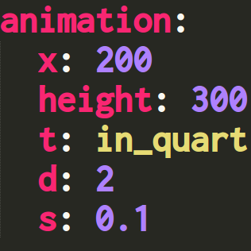
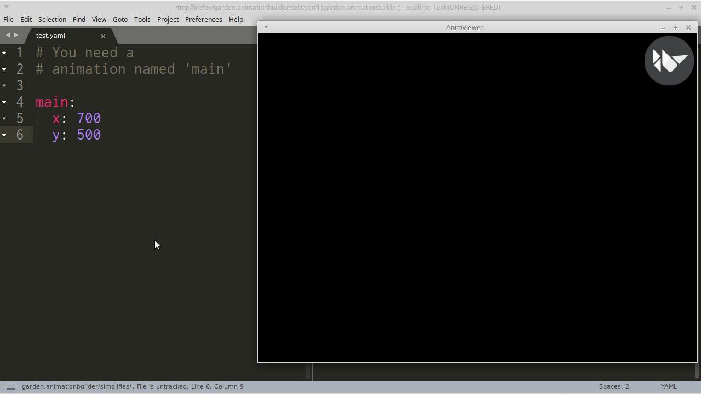

# AnimationBuilder: Easy way of writing Kivy Animations

Using `kivy.animation.Animation` directly is a pain. `AnimationBuilder` provides you with easy way.  



## Usage

### Basic

```python
from kivy.garden.animationbuilder import AnimationBuilder


anims = AnimationBuilder.load_string(r'''
move_to_right:
  right: 800
  d: 2
move_to_top:
  top: 600
  t: in_out_cubic
''')

anims['move_to_right'].start(some_widget1)
anims['move_to_top'].start(some_widget2)
```

The code above is equivalent to:  

```python
from kivy.animation import Animation

Animation(right=800, d=2).start(some_widget1)
Animation(top=600, t='in_out_cubic').start(some_widget2)
```

The former looks even worse than the latter. But when you write more complex animations, the latter becomes unreadable.  

### Sequential Animation

```yaml
test_sequence:
  sequence:  # You can use 'S' instead of 'sequence'
    - right: 800
      d: 2
    - top: 600
      t: in_out_cubic
```

You can use other animations inside.

```yaml
move_to_right:
  right: 800
  d: 2
test_sequence:
  S:
    - move_to_right
    - top: 600
      t: in_out_cubic
```

### Parallel Animation

```yaml
move_to_right:
  right: 800
  d: 2
test_parallel:
  parallel:   # You can use 'P' instead of 'parallel'
    - move_to_right
    - top: 600
      t: in_out_cubic
```

### Nest as you like

```yaml
more_nesting:
  P:
    - S:
        - opacity: 0
          d: 0.3
          t: in_out_quad
        - opacity: 1
          d: 0.3
          t: in_out_quad
      repeat: True
    - S:
        - right: 800
        - top: 600
        - x: 0
        - y: 0
        - d: 1
      repeat: True
```

But the code below might be easier to read.  

```yaml
less_nesting:
  P:
    - move_rectangulary
    - blinking

blinking:
  S:
    - opacity: 0
      d: 0.3
      t: in_out_quad
    - opacity: 1
      d: 0.3
      t: in_out_quad
  repeat: True

move_rectangulary:
  S:
    - right: 800
    - top: 600
    - x: 0
    - y: 0
    - d: 1
  repeat: True
```

### eval

You can use python expression.  

```python
from random import random
from kivy.utils import get_random_color

from kivy.garden.animationbuilder import AnimationBuilder


anims = AnimationBuilder.load_string(r'''
change_color:
    color: "eval: get_random_color()"
    d: "eval: random() + additional_time"
''')
anims.globals = {
    'get_random_color': get_random_color,
    'random': random,
    'additional_time': 1,
}
# anims.locals = None

anim = anims['change_color']  # This is where `eval`s are excuted.
anim.start(some_widget)
```

`eval` is excuted when animation is created. `locals` and `globals` attributes are directly passed to built-in function `eval()`.  

### locals & globals

You can access to the `globals` and `locals` directly.  

```python
from kivy.utils import get_random_color

from kivy.garden.animationbuilder import AnimationBuilder


anims = AnimationBuilder.load_string(r'''
change_color:
    color: "globals: external_value"
''')
anims.globals = {'external_value': get_random_color(), }

anim = anims['change_color']  # This is where `globals` and `locals` are evaluated.
anim.start(some_widget)
```

Like `eval`, `globals` and `locals` are evaluated when animation is created.  

### exec

You can use python statements.  

```yaml
some_animation:
    S:
        - exec: |  # This is one of methods to write multiline string in YAML.
            target.pos = (500, 500, )
            target.opacity = 1
        - pos: [0, 0, ]
          opacity: 0.2
        - "exec: target.opacity = 1"
        - exec: ""
```

Unlike `eval`, `exec` is excuted when animation is played. And by using a identifier `target`, you can access to the widget that associated to the animation. Like `eval` you can use `locals` and `globals`.  

### exec_on_create

`exec_on_create` is the same as `exec` except it's excuted when animation is created. This is useful when you wanna share values inside a animation.  

```yaml
__init__:
    exec_on_create: |
        from random import random

some_animation:
    S:
        - exec_on_create: "shared_value = random() + 1"
        - P:
            - pos: [500, 500]
              d: "eval: shared_value"
            - opacity: 0
              d: "eval: shared_value"
              t: out_sine
```


### \_\_init\_\_

Animation named `\_\_init\_\_` is special. It's automatically created when YAML data is loaded.


## Live Preview

Just like [kviewer](https://github.com/kivy/kivy/blob/master/kivy/tools/kviewer.py), livepreview.py allowing you to dynamically display the animation.

```text
python3 ./livepreview.py filename.yaml
```

  


## Requirements

- pyyaml
- watchdog (optional, only needed by livepreview.py)

## Notes

### Everytime you call `__getitem__()`, it returns a new instance

so  `anims['key'] is anims['key']` is always False.  

### Be careful of using some words (YAML in general)

There are so many words that are translated as boolean value.  
For instance: Yes, No, y, n, ON, OFF  [more info](http://yaml.org/type/bool.html)

### Be careful of using `locals`

The code below works fine, when `locals = None`(default) and `globals = {}`(default).  

```yaml
__init__:
  exec_on_create: |
    from random import random
    def random_pos():
      return (random() * 300, random() * 300, )

main:
  pos: "eval: random_pos()"
```

But it doesn't work when `locals = {}` and `globals = None`. Same for when `locals = {}` and `globals = {}`.  

```text
NameError: name 'random' is not defined
```

It seems `eval()` doesn't look `locals` up when resolving `random` during excution of `random_pos()`. So unless you know how `locals` and `globals` works in `eval()` and `exec()`, should not use `locals`.  

## Others

[Youtube](https://www.youtube.com/playlist?list=PLNdhqAjzeEGiF1oLISnCCPoPj1FhZbOAP)  

**Tested Environment**  
Python 3.5.0 + Kivy 1.10.0  
Python 2.7.2 + Kivy 1.10.0  
